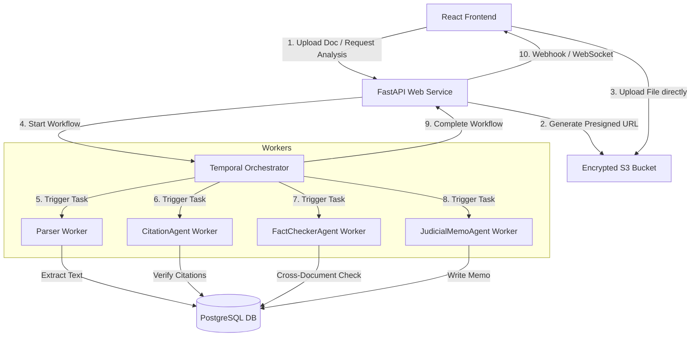

# BS Detector: Production Readiness Plan

This document outlines the system design and architecture for transitioning the BS Detector prototype into a robust, multi-tenant enterprise MVP.

---

## 1. Scale, Latency & Quality Assumptions

### Target Audience & Ingestion Scale
* **Audience**: Law firms, legal departments, and judicial clerks processing litigation files.
* **Matter Complexity**: A single matter consists of a Motion for Summary Judgment (MSJ) and **10 to 100+ supporting documents** (exhibits, depositions, medical records, police reports).
* **Document Sizes**: Averaging 2MB to 20MB, but up to 50MB for scanned PDF files.

### Workload & Latency
* **Launch Scale**: Support 200+ concurrent active users with a path to 10,000+ users.
* **Pipeline Latency**: Running multiple agents, citation lookups, and cross-document fact checks takes **2 to 10 minutes** depending on document length. This requires a fully asynchronous execution model.
* **API Rate Limits**: Enterprise LLM integrations impose rate limits (TPM/RPM). The system must handle these limits natively without dropping user requests.

---

## 2. System Architecture

To support long-running agent workflows, secure multi-tenancy, and high availability, I choose an **Asynchronous Event-Driven Architecture** using **Temporal** for workflow orchestration.



### Core Components
1. **Web Service (FastAPI)**: Stateless API layer handling authentication, tenant verification, S3 presigned URL generation, and report query endpoints.
2. **Object Storage (AWS S3)**: Secure, encrypted landing zone for raw uploaded PDF/Docx files.
3. **Temporal Orchestration Engine**: Manages the stateful DAG of the multi-agent pipeline. It handles workflow states, retries, exponential backoff, and rate-limiting natively — this is the primary reason Temporal is chosen over ad-hoc queues.
4. **Worker Pool (Python)**: Separate processes executing agent logic:
   * **Parser Workers**: Extract text from scanned PDFs via OCR.
   * **Agent Workers**: Execute CitationAgent, FactCheckerAgent, JudicialMemoAgent prompt logic.

---

## 3. Data & Storage Design

### Database: PostgreSQL
I select **PostgreSQL** as the primary relational database.
* **Why PostgreSQL?** ACID compliance, JSONB columns (ideal for dynamic agent outputs), `pgvector` support for embedding-based RAG retrieval across long exhibits, and mature Row-Level Security for tenant isolation.
* **Schema Outline**:
  * `tenants` (id, name, created_at)
  * `users` (id, tenant_id, email, password_hash)
  * `matters` (id, tenant_id, name, status)
  * `documents` (id, matter_id, s3_key, doc_type, status, extracted_text_ref)
  * `analysis_jobs` (id, matter_id, status, started_at, completed_at, temporal_workflow_id)
  * `verification_reports` (id, job_id, citation_analysis [JSONB], fact_analysis [JSONB], judicial_memo, risk_level)
  * `evidence_spans` (id, report_id, doc_id, page_num, char_start, char_end, finding_id) — see §6

### Data Durability Policy
* **Durable**: Extracted document text, validated citation statuses, evidence spans, and final verification reports stored in PostgreSQL/S3.
* **Transient**: Intermediate LLM token streams cached in Redis (discarded after pipeline completion) to control storage costs.

---

## 4. Security & Tenant Isolation

Legal data contains sensitive corporate secrets and PII/PHI. Absolute tenant separation is required.

### Database Row-Level Security (RLS)
Tenant isolation is enforced at the database layer:
```sql
ALTER TABLE matters ENABLE ROW LEVEL SECURITY;
CREATE POLICY tenant_isolation_policy ON matters
    USING (tenant_id = current_setting('app.current_tenant_id'));
```
Every API query sets `app.current_tenant_id` from the user's validated JWT. This prevents cross-tenant data leakage at the query level, independent of application logic.

### Data Encryption
* **In Transit**: TLS 1.3 for all external and internal microservice communication.
* **At Rest**: S3 encrypted via AWS KMS. Enterprise customers may supply Customer-Managed Keys (CMK), allowing them to revoke access to their documents instantly.

---

## 5. AI Orchestration & Cost Control

### Why Temporal (and not Celery first)

A key design decision is to start with Temporal from day one rather than building on Celery first.

**The rationale**: Celery + Redis is simpler to stand up for basic job queues, but it lacks durable workflow state. If a Celery worker crashes mid-pipeline (after CitationAgent finishes but before FactCheckerAgent starts), the job is silently lost or must be retried from scratch. For a multi-agent legal pipeline where LLM calls are expensive, that is unacceptable.

Temporal provides:
* **Durable execution**: The workflow execution history is persisted. If a worker crashes, Temporal resumes from the exact failed activity — no re-running earlier steps.
* **Native retry + backoff**: LLM rate-limit errors (`429`) are handled automatically with exponential backoff per activity, without any custom error handling code.
* **Built-in visibility**: The Temporal Web UI shows exactly which step a workflow is on, which activities failed, and why — directly replacing the observability tooling you'd need to bolt onto Celery.

The Temporal dev server runs as a single Docker container with minimal config. The incremental cost over Celery+Redis at launch scale is low, and the operational headaches avoided (especially around partial failure) justify it. Celery is intentionally skipped — it is not a phase on the way to Temporal; it is simply the wrong tool for this problem.

### Cost Control & Latency Management
1. **Model Grading (Cascade)**:
   * **Tier 1 (GPT-4o-mini)**: High-volume text parsing and initial citation extraction.
   * **Tier 2 (GPT-4o / o1-mini)**: Complex legal reasoning, quote accuracy matching, and cross-document fact verification.
2. **Semantic Caching**:
   * Store verified citation fingerprints (case name + reporter + page) in Redis. Subsequent queries for the same citation (e.g., *Privette v. Superior Court*) skip the LLM call entirely, using the cached result.

---

## 6. Legal Citation Authority Verification

A core weakness of relying solely on LLM memory for citation checking is that the model has no live access to legal databases and may confidently hallucinate a case's existence. The production system must integrate authoritative external sources.

### Citation Database Integration

| Source | Coverage | Access Model |
|--------|----------|--------------|
| **Westlaw / LexisNexis API** | Comprehensive (all US federal + state) | Commercial license; per-query pricing |
| **CourtListener (PACER/Free Law Project)** | Federal courts (opinions, dockets) | Free REST API; rate-limited |
| **California Courts Open Access** | CA appellate + Supreme Court opinions | Free; XML bulk download available |
| **Google Scholar Case Law** | US federal + many state | Web scraping / unofficial API |

### Citation Verification Pipeline

Rather than asking the LLM "does this case exist?", the production CitationAgent:
1. Extracts the citation string (parties, reporter, volume, page, year).
2. Queries CourtListener or a licensed database for exact match by reporter + page.
3. If found: compares the quoted language against the retrieved opinion text using string similarity (e.g., Levenshtein distance or embeddings).
4. If not found: marks `is_citation_real: false` (definitively) rather than `could_not_verify`.

This eliminates the ambiguity inherent in LLM-based citation verification and makes the system defensible in a legal context.

---

## 7. Document Provenance & Evidentiary Traceability

Legal users must be able to trace every flagged finding back to the exact source passage that contradicted it. "The police report says X" is not sufficient — they need to see the paragraph, and eventually the page and line number.

### Evidence Span Model

Each flagged finding stores source coordinates in the `evidence_spans` table:
```
evidence_spans:
  id, report_id, doc_id, page_num, char_start, char_end, finding_id, excerpt
```

This enables:
* **Click-through**: The UI can link a finding to the exact page in the uploaded document.
* **Audit trail**: Every conclusion is traceable to a source passage, satisfying e-discovery and admissibility requirements.
* **Eval improvement**: Span-level ground truth enables much more precise evaluation metrics than keyword matching.

### Why this matters for the eval

The current eval harness uses keyword matching against claim text. This works for a prototype but has two known failure modes: (1) it can be gamed by outputting verbose claims that include ground-truth keywords, and (2) it cannot detect when a correct-sounding claim is supported by the wrong passage. Span-level evidence would allow evaluators to check whether the cited evidence actually contains the contradiction — a stronger correctness signal.

---

## 8. Observability & Telemetry

1. **Structured Auditing**: Every flagged finding stores the exact document excerpt used. Users can click through to the source, satisfying e-discovery requirements.
2. **Tracing and Prompt Monitoring**: Workers instrumented with **OpenTelemetry** + **Arize Phoenix** or **LangSmith** for token count, prompt latency, and per-agent decision tracing.
3. **Automated Regression Testing**: `run_evals.py` integrated into CI/CD. Every prompt change is tested against a regression dataset of historical cases. Precision and recall gates block merges that degrade quality.

---

## 9. Sequencing (Implementation Roadmap)

### Phase 1: MVP Infrastructure (Weeks 1–3)
* **Goal**: Secure async ingestion pipeline with real document uploads.
* **Scope**:
  * PostgreSQL (with RLS) + S3 bucket encryption set up.
  * **Temporal** (dev server → managed cloud) for async agent orchestration — start here, not Celery.
  * PDF text extraction (pdfplumber / Azure Document Intelligence for scans).
  * CitationAgent wired to CourtListener for basic citation existence checks.
  * React UI updated to support file upload + job polling (WebSocket or SSE).

### Phase 2: Enterprise Scaling & Reliability (Weeks 4–6)
* **Goal**: Production-grade quality, cost controls, and observability.
* **Scope**:
  * Model grading cascade (GPT-4o-mini → GPT-4o) based on task complexity.
  * Semantic citation cache in Redis.
  * OpenTelemetry tracing + eval regression CI gate.
  * Evidence span storage and UI click-through to source documents.
  * Westlaw/LexisNexis integration for authoritative citation resolution.

### Deferred for Post-Launch
* **Self-hosted LLMs**: Fine-tuning proprietary open-source models (Llama-3) for citation classification — deferred until we have enough labeled data from production usage.
* **Multi-Region Database Replication**: Deferred until traffic demands geographic redundancy.
