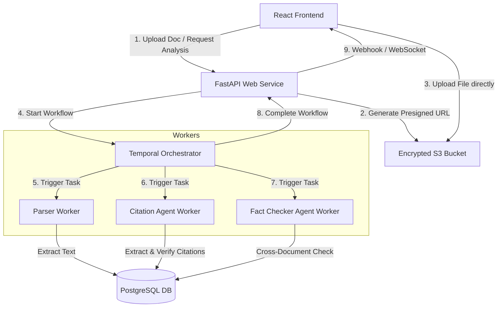

# BS Detector: Production Readiness Plan

This document outlines the system design and architecture for transitioning the BS Detector prototype into a robust, multi-tenant enterprise MVP.

---

## 1. Scale, Latency & Quality Assumptions

### Target Audience & Ingestion Scale
* **Audience**: Law firms, legal departments, and judicial clerks processing litigation files.
* **Matter Complexity**: A single matter consists of a Motion for Summary Judgment (MSJ) and **10 to 100+ supporting documents** (exhibits, depositions, medical records, police reports).
* **Document Sizes**: Averaging 2MB to 20MB, but up to 50MB for scanned PDF files.

### Workload & Latency
* **Launch Scale**: Support 200+ concurrent active users with a path to 10,000+ users.
* **Pipeline Latency**: Running multiple agents, case citation lookups, and cross-document fact checks takes **2 to 10 minutes** depending on document length. This requires a fully asynchronous execution model.
* **API Rate Limits**: Enterprise LLM integrations impose rate limits (TPM/RPM). The system must handle these limits natively without dropping user requests.

---

## 2. System Architecture

To support long-running agent workflows, secure multi-tenancy, and high availability, I choose an **Asynchronous Event-Driven Architecture** utilizing **Temporal** for workflow orchestration.



### Core Components
1. **Web Service (FastAPI)**: Stateless API layer handling user authentication, tenant verification, upload request generation (S3 presigned URLs), and query endpoints for analysis reports.
2. **Object Storage (AWS S3)**: Secure, encrypted landing zone for raw uploaded PDF/Docx files.
3. **Temporal Orchestration Engine**: Manages the stateful DAG (Directed Acyclic Graph) of the multi-agent pipeline. It handles workflow states, retries, backoffs, and rate-limiting.
4. **Worker Pool (Python/Go)**: Separate microservices executing CPU-intensive tasks:
   * **Parser Workers**: Extract text from scans and OCR documents.
   * **Agent Workers**: Execute the prompt logic for the `CitationAgent` and `FactCheckerAgent`.

---

## 3. Data & Storage Design

### Database: PostgreSQL
I select **PostgreSQL** as our primary relational database.
* **Why PostgreSQL?** It provides ACID transaction compliance, handles JSONB columns (ideal for storing dynamic, structured agent reports), and supports `pgvector` for embedding-based retrieval (RAG) when searching long exhibits.
* **Schema Outline**:
  * `tenants` (id, name, created_at)
  * `users` (id, tenant_id, email, password_hash)
  * `matters` (id, tenant_id, name, status)
  * `documents` (id, matter_id, s3_key, doc_type, status, extracted_text_ref)
  * `analysis_jobs` (id, matter_id, status, started_at, completed_at, temporal_workflow_id)
  * `verification_reports` (id, job_id, citation_analysis [JSONB], fact_analysis [JSONB])

### Data Durability Policy
* **Durable Storage**: Extracted document text, case metadata, validated citation statuses, and final verification reports must be stored durably in PostgreSQL/S3.
* **Transient Storage**: Intermediate LLM responses and raw agent messages can be cached in Redis or discarded after the run is finalized to control storage costs.

---

## 4. Security & Tenant Isolation

Legal data contains sensitive corporate secrets, proprietary information, and PII/PHI. Absolute tenant separation is required.

### Database Row-Level Security (RLS)
I enforce tenant isolation at the database layer using PostgreSQL Row-Level Security:
```sql
ALTER TABLE matters ENABLE ROW LEVEL SECURITY;
CREATE POLICY tenant_isolation_policy ON matters
    USING (tenant_id = current_setting('app.current_tenant_id'));
```
Every query issued by the API layer sets the session context `app.current_tenant_id` based on the user's validated JWT. This prevents database queries from accidentally leaking records to other tenants.

### Data Encryption
* **Encryption in Transit**: TLS 1.3 for all external and internal microservice communication.
* **Encryption at Rest**: S3 buckets are encrypted using AWS KMS. Enterprise customers can supply their own Customer-Managed Keys (CMK) via KMS, allowing them to revoke access to their documents instantly.

---

## 5. AI Orchestration & Cost Control

### Temporal Workflow Execution
* **Why Temporal?** Rather than using Celery (which lacks built-in state machines) or custom cron loops, Temporal tracks the execution history of each agent. If an agent worker crashes mid-run, Temporal resumes the execution at the exact step it failed.
* **Handling Rate Limits**: When the LLM provider returns a `429 Too Many Requests`, the Temporal worker applies exponential backoff and jitter automatically, ensuring jobs eventually complete without user intervention.

### Cost Control & Latency Management
1. **Model Grading (Cascade)**:
   * **Tier 1 (GPT-4o-mini)**: Used for high-volume text parsing and initial citation extraction.
   * **Tier 2 (GPT-4o)**: Used only for complex legal reasoning, quote accuracy matching, and cross-document fact verification.
2. **Semantic Caching**:
   * Store verified legal citations in a shared Redis cache (e.g., *Privette v. Superior Court* has a static ruling and quote). Subsequent analyses of this case citation across different matters skip LLM calls, reducing API costs and latency.

---

## 6. Observability & Telemetry

1. **Structured Auditing**:
   * Legal users must be able to click on any flagged issue and see *why* it was flagged. The report stores the exact document coordinates or paragraph quotes used to confirm/deny assertions.
2. **Tracing and Prompt Monitoring**:
   * Instrument workers using **OpenTelemetry** and an LLM observability platform (e.g., **Arize Phoenix** or **LangSmith**). This allows us to track token count, prompt latency, and trace the decision-making chain of individual agents.
3. **Automated Regression Testing**:
   * Integrate the evaluation harness (`run_evals.py`) into the CI/CD pipeline. Every code change runs against a regression dataset of historical cases to ensure that changes to prompts do not decrease precision or recall.

---

## 7. Sequencing (Implementation Roadmap)

### Phase 1: MVP Infrastructure (Weeks 1–3)
* **Goal**: Build a secure, functional asynchronous ingestion pipeline.
* **Scope**:
  * Set up PostgreSQL with RLS and AWS S3 bucket encryption.
  * Implement Celery/Redis queue for async jobs.
  * Integrate PDF text parsing and basic citation extraction.
  * Connect the React UI to support file upload and basic report polling.

### Phase 2: Enterprise Scaling & Resilience (Weeks 4–6)
* **Goal**: Maximize reliability, scale, and cost-efficiency.
* **Scope**:
  * Transition from Celery to **Temporal** for resilient workflow orchestration.
  * Implement **Model Grading** (running cheap models first) and semantic cache.
  * Establish OpenTelemetry monitoring and LLM evaluation tracing.

### Deferred for Post-Launch
* **Self-hosted LLMs**: Fine-tuning proprietary open-source models (like Llama-3) to run in-house.
* **Multi-Region Database Replication**: Defer global replication until traffic demands geographic redundancy.
